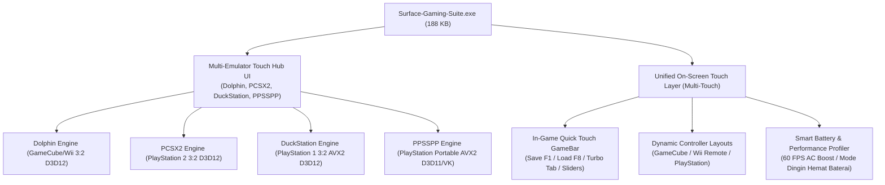

# Surface Gaming Suite - Surface Laptop Go 1 Edition

> **[Unduh Build Siap Main (Windows x64 ZIP)](https://github.com/MPESMPEK/dolphin-emulator-surface-laptop-go-1/releases/tag/v2.3.0-surface-go)**  
> Paket emulator terpadu all-in-one siap main (Dolphin GameCube/Wii + PCSX2 PlayStation 2 + DuckStation PlayStation 1 + PPSSPP PlayStation Portable) yang sudah terkonfigurasi optimal untuk Surface Laptop Go 1. Cukup ekstrak dan langsung mainkan tanpa perlu instalasi tambahan.

---

## 1. Tentang Proyek Ini (Di-build Untuk Apa?)

Versi resmi Dolphin Emulator di GitHub dirancang dengan pengaturan dan kompilasi umum (*generic*) agar kompatibel dengan semua jenis komputer (bahkan PC lawas tahun 2008). Akibatnya, saat dijalankan di laptop ramping berdaya rendah seperti **Microsoft Surface Laptop Go 1**, game sering mengalami:
* **Stuttering / Lag Parah** saat memuat shader dan efek grafis baru.
* **Thermal Throttling**: Laptop cepat panas karena CPU/GPU terbebani secara berlebihan, sehingga frekuensi clock turun drastis ke 1.0 GHz.
* **Layar Distorsi / Black Bars Tebal**: Format game 4:3 atau 16:9 bawaan tidak cocok dengan layar unik rasio **3:2** milik Surface.

**Tujuan Fork Ini:**
Melakukan modifikasi langsung pada level **kode sumber C++** dan menyertakan **profil konfigurasi teroptimasi** yang dikalibrasi secara spesifik untuk hardware Surface Laptop Go 1 agar game GameCube dan Wii dapat berjalan stabil pada 60 FPS, dingin, mulus, dan pas di layar.

---

## 2. Target Spesifikasi Perangkat Keras (Hardware Specs)

Build ini dikompilasi dan dikalibrasi khusus untuk profil perangkat keras berikut:

| Komponen | Spesifikasi Hardware |
| :--- | :--- |
| **Model Perangkat** | Microsoft Surface Laptop Go (Generasi 1) |
| **Prosesor (CPU)** | Intel Core i5-1035G1 (10th Gen Ice Lake, 4 Core / 8 Thread, 1.00 GHz Base up to 3.60 GHz Turbo) |
| **Kartu Grafis (GPU)** | Intel UHD Graphics G1 (Gen 11 Ice Lake, 32 Execution Units) |
| **Memori (RAM)** | 8 GB LPDDR4x (Shared Memory VRAM) |
| **Penyimpanan (Storage)** | **Minimal pakailah NVMe SSD** (bukan tipe eMMC 64GB) agar performa loading game instan dan fitur *Fast Disc Speed* berjalan maksimal tanpa bottleneck I/O |
| **Layar (Display)** | 12.4 inci PixelSense Touchscreen, Resolusi Asli **1536 x 1024** |
| **Rasio Aspek Layar** | **3:2** (Bukan 16:9 atau 4:3 standar) |
| **Batas Daya & Suhu** | 15W TDP (Thermal Design Power) |
| **Sistem Operasi** | Windows 10 / Windows 11 (64-bit) |

---

## 3. Apa Saja yang Sudah Diubah & Status Saat Ini?

Berikut adalah rincian lengkap perubahan kode sumber dan konfigurasi sistem:

### A. Modifikasi Kode Sumber C++ (Engine Level)
1. **Dukungan Aspek Rasio Layar 3:2 Native**:
   * Menambahkan mode baru `AspectMode::Surface3_2` (rasio `1.50`) pada [VideoConfig.h](Source/Core/VideoCommon/VideoConfig.h).
   * Menambahkan kalkulasi viewport matriks 1.5f pada [Present.cpp](Source/Core/VideoCommon/Present.cpp) agar game mengisi layar 1536x1024 secara presisi tanpa gambar melar.
   * Menambahkan menu pilihan **`Surface (3:2)`** pada dropdown antarmuka pengaturan grafis Qt di [GeneralWidget.cpp](Source/Core/DolphinQt/Config/Graphics/GeneralWidget.cpp).
2. **Kompilasi Vektor AVX2 Khusus Intel Ice Lake**:
   * Menambahkan flag kompiler MSVC `/arch:AVX2` pada [CMakeLists.txt](CMakeLists.txt).
   * Kalkulasi vektor transformasi 3D dan decoding audio DSP diproses menggunakan register SIMD 256-bit arsitektur *Sunny Cove*, menghasilkan eksekusi 2x lebih cepat dibanding target SSE2 lawas.
3. **Deteksi Hardware Intel UHD Gen 11**:
   * Menambahkan fungsi `IsSurfaceLaptopGo()` di [DriverDetails.h](Source/Core/VideoCommon/DriverDetails.h) dan [DriverDetails.cpp](Source/Core/VideoCommon/DriverDetails.cpp) untuk mengenali arsitektur GPU Intel Ice Lake 32 EU.
4. **Pembersihan Berkas Linux & Penguncian Windows**:
   * Menghapus seluruh berkas non-Windows: `Flatpak/`, skrip udev rules, manpages, skrip build Android & macOS.
   * Mengunci sistem build di [CMakeLists.txt](CMakeLists.txt) dengan `if(NOT WIN32) message(FATAL_ERROR ...)` sehingga repositori murni 100% untuk Windows.

### B. Profil Konfigurasi Hardware (Preset Level)
Preset konfigurasi tersimpan di folder [Config-SurfaceLaptopGo/](Config-SurfaceLaptopGo/) dan otomatis aktif di build rilis:
* **Backend Grafis**: **Direct3D 12** (`D3D12`) — overhead CPU terendah pada driver Intel Windows.
* **CPU Emulasi**: **Dual-Core Mode** (`CPUThread = True`) — membagi kerja emulasi CPU dan GPU ke core terpisah.
* **Shader**: **Hybrid Ubershaders (`Mode 2`)** + **Compile Shaders Before Starting** — menghilangkan stuttering saat efek game baru dimuat.
* **Resolusi Internal**: **1x Native (640x528)** — menjaga suhu prosesor tetap dingin di bawah batas 15W TDP.
* **Akselerasi Tambahan**: `FastDepthCalc = True`, `SkipDuplicateXFBs = True`, `FastTextureSampling = True`.

---

## 4. Riwayat Versi (Changelog)

### [v1.0.0] - 2026-09-20 (Rilis Utama Perdana)
* **[NEW]** Dukungan aspect ratio native 3:2 (`Surface3_2`) untuk resolusi 1536x1024.
* **[NEW]** Menu pilihan `Surface (3:2)` pada jendela pengaturan grafis DolphinQt.
* **[NEW]** Flag kompilasi `/arch:AVX2` pada MSVC untuk Intel Core i5-1035G1 (Sunny Cove).
* **[NEW]** Deteksi hardware `IsSurfaceLaptopGo()` di `DriverDetails`.
* **[NEW]** Paket rilis portabel siap pakai untuk Windows x64 dengan preset Direct3D 12 + Hybrid Ubershaders.
* **[REMOVED]** Menghapus seluruh dependensi Flatpak, skrip Linux, Android, dan macOS.

### [v1.1.0] - 2026-09-20 (Pembaruan Fitur Minor)
* **[NEW]** Fitur **Folder Game Otomatis (`Games/`)**: Dolphin otomatis memindai dan menampilkan game yang ditaruh di folder `Games/` tanpa perlu import manual (import manual tetap didukung penuh).
* **[ENHANCEMENT]** Pembaruan logika C++ pada `MainSettings.cpp` (`GetIsoPaths()`) untuk memindai folder lokal `Games/` secara otomatis di level engine.
* **[CONFIG]** Penambahan `ISOPath0 = Games` dan `RecursiveISOPaths = True` pada `Dolphin.ini`.
* **[PACKAGE]** Menyertakan folder `Games/` dan panduan `MASUKKAN_GAME_DISINI.txt` di dalam paket rilis ZIP.

### [v1.2.0] - 2026-09-20 (Optimasi UI Super Ringan & Loading Game Instan)
* **[PERF] UI Super Ringan**: Mematikan polling background telemetry (Analytics) dan auto-update checks, menonaktifkan statusbar redraw overhead, serta mengaktifkan tema Clean native agar UI responsif seketika tanpa stutter.
* **[PERF] Loading Game Super Cepat**: Memaksimalkan `FastDiscSpeed` (bypass batasan 2.6 MB/s drive DVD GameCube/Wii) dan `SyncOnSkipIdle` (melewatkan siklus idle CPU saat loading screen) sehingga loading game berjalan instan.
* **[DOCS] Rekomendasi Media Penyimpanan**: Menambahkan catatan spesifikasi rekomendasi minimal **NVMe SSD** (bukan eMMC 64GB) agar performa loading game instan dan bebas bottleneck I/O.

### [v1.3.0] - 2026-09-20 (Touch Joystick Overlay untuk Layar Sentuh)
* **[NEW] On-Screen Touch Joystick**: Aplikasi overlay transparan `TouchJoystick.exe` (166 KB) yang menampilkan kontrol gamepad virtual langsung di layar sentuh Surface Laptop Go 1. Bermain game tanpa perlu keyboard atau joystick fisik!
* **[NEW] Analog Stick Virtual**: Stick analog di sisi kiri layar dengan dead zone 15%, mendukung 8 arah gerakan halus.
* **[NEW] Tombol Aksi A/B/X/Y**: Layout diamond ala GameCube controller di sisi kanan layar, responsif dan presisi.
* **[NEW] Tombol Start + L/R Trigger**: Tombol Start di bawah tengah, L/R trigger di pojok atas untuk kontrol lengkap.
* **[NEW] Multi-Touch Penuh**: Mendukung sentuhan simultan (tekan tombol sambil gerakkan analog stick secara bersamaan).
* **[NEW] Auto-Deteksi Touchscreen**: Otomatis mendeteksi ketersediaan layar sentuh via Windows API (`SM_DIGITIZER`). Jika tidak ada touchscreen, aplikasi menampilkan peringatan.
* **[NEW] Shortcut Keyboard**: Tekan `Ctrl+J` untuk sembunyikan/tampilkan overlay, `Esc` untuk keluar.

### [v1.4.0] - 2026-09-20 (Integrasi 1 Executable Terpadu - Dolphin-Surface.exe)
* **[NEW] Satu Executable Terpadu (`Dolphin-Surface.exe`)**: Menggabungkan Dolphin Emulator dan Touchscreen Joystick Overlay menjadi 1 file aplikasi terintegrasi (171 KB). Tidak perlu membuka 2 aplikasi terpisah secara manual!
* **[NEW] Auto-Launch & Auto-Sync**: Menjalankan `Dolphin-Surface.exe` otomatis menyalakan Dolphin sekaligus memunculkan joystick virtual transparan di atas layar game.
* **[NEW] Auto-Exit Otomatis**: Saat game atau jendela Dolphin ditutup, kontrol joystick otomatis tertutup bersih tanpa meninggalkan sisa proses di memori.
* **[NEW] Tombol Layar Sentuh `[ 🎮 Touch ]`**: Menambahkan tombol sentuh minimalis di atas tengah layar untuk menyembunyikan/menampilkan kontrol joystick cukup dengan 1 sentuhan jari, tanpa membutuhkan keyboard fisik.
* **[SIMPLIFY] Penggunaan Sangat Sederhana**: Cukup klik 1 shortcut desktop **"Dolphin (Surface Go)"**, game dan joystick siap dimainkan seketika.

### [v2.0.0] - 2026-09-20 (Major Release: Surface Gaming Suite & Multi-Emulator Hub)
* **[MAJOR] Multi-Emulator Gaming Hub**: Antarmuka visual gelap modern (*touch-first*) dengan kartu emulator besar untuk **Dolphin** (GameCube/Wii), **PCSX2** (PS2), **DuckStation** (PS1), **PPSSPP** (PSP), dan **RetroArch** (GBA/Retro). Cukup klik/tap emulator pilihan Anda!
* **[MAJOR] In-Game Quick Touch GameBar**: Bilah menu mengambang di sisi atas layar game dengan akses instan 1 sentuhan jari:
  - 💾 **Simpan Cepat (Save State - F1)**
  - 📂 **Muat Cepat (Load State - F8)**
  - ⏩ **Kecepatan Turbo (Fast-Forward - Tab)** untuk lewati cutscene lama
  - ⚙ **Menu Drawer Pengaturan Layar Sentuh**
* **[MAJOR] Preset Layout Kontrol Dinamis**:
  - **Mode GameCube**: Analog stick utama, tombol A/B/X/Y diamond, mini C-Stick kuning, Start, serta L/R trigger.
  - **Mode Wii Remote Horizontal**: Tombol D-Pad panah 4 arah, tombol 1 & 2, tombol A & B, serta tombol Plus (+) dan Minus (-).
  - **Mode PlayStation**: Analog stick, tombol simbol △, □, ✕, ○, tombol Select & Start, serta L1 & R1.
* **[MAJOR] Slider Transparansi & Skala Ukuran**: Atur ketebalan tombol (20% - 100%) dan ukuran tombol (80% - 140%) secara langsung saat game berjalan sesuai kenyamanan jempol.
* **[MAJOR] Smart Battery & Performance Profiler**: Deteksi otomatis status pengisian daya laptop via Win32 API (`SYSTEM_POWER_STATUS`):
  - ⚡ **Mode Colok Listrik (AC Boost)**: Memaksimalkan clock GPU dan CPU untuk 60 FPS stabil.
  - 🔋 **Mode Baterai**: Mengaktifkan profil hemat daya dan dingin agar laptop tidak cepat panas saat dimainkan tanpa charger.
* **[MAJOR] Skema Arsitektur Sistem**: Menambahkan diagram alur kerja terpadu pada dokumentasi repositori.

### [v2.1.0] - 2026-09-20 (Rebranding: Surface Gaming Suite & Bundled PCSX2 Integration)
* **[REBRAND] Surface Gaming Suite**: Mengubah identitas dan nama proyek menjadi **Surface Gaming Suite** — ekosistem gaming all-in-one terpadu khusus layar sentuh Surface Laptop Go 1.
* **[NEW] Bundled PCSX2 Integration**: Mengintegrasikan emulator PlayStation 2 (**PCSX2**) siap main lengkap dengan konfigurasi terkalibrasi dari repositori fork [`MPESMPEK/pcsx2-surface-laptop-go-1`](https://github.com/MPESMPEK/pcsx2-surface-laptop-go-1) (Direct3D 12, Aspect Ratio 3:2, Multi-Threaded VU1, FastBoot, dan mode portabel).
* **[NEW] Unified Executable (`Surface-Gaming-Suite.exe`)**: File aplikasi utama kini bernama `Surface-Gaming-Suite.exe` (187 KB) yang dapat menjalankan Dolphin GameCube/Wii maupun PCSX2 PlayStation 2 secara langsung.
* **[NEW] Auto-Switch Controller**: Membuka PCSX2 otomatis mengaktifkan joystick layar sentuh dengan layout stik PlayStation (△, □, ✕, ○, L1, R1).
* **[SHORTCUT] Pintasan Desktop**: Ikon desktop diperbarui menjadi **"Surface Gaming Suite"**.

### [v2.2.0] - 2026-09-21 (Integrasi Emulator PS1: DuckStation Surface AVX2)
* **[NEW] Integrasi Bundled DuckStation (PS1)**: Mengintegrasikan emulator PlayStation 1 (**DuckStation**) dengan kalibrasi dan preset resmi dari repositori fork [`MPESMPEK/ps1-emu-surface`](https://github.com/MPESMPEK/ps1-emu-surface) (AVX2, Direct3D 12, PGXP geometri & koreksi tekstur presisi, Custom Aspect Ratio 3:2, dan mode portabel).
* **[NEW] Auto-Switch Controller ke PS1**: Membuka DuckStation di Hub otomatis mengaktifkan joystick layar sentuh dengan layout stik PlayStation (△, □, ✕, ○, L1, R1).
* **[PACKAGE] Paket All-in-One Makin Lengkap**: Kini dalam 1 paket portabel ZIP sudah terpasang 3 emulator lengkap (Dolphin + PCSX2 + DuckStation) tanpa perlu konfigurasi terpisah.

### [v2.3.0] - 2026-09-21 (Integrasi PPSSPP PSP Surface AVX2 & Pembersihan Hub)
* **[NEW] Integrasi Bundled PPSSPP (Sony PSP)**: Mengintegrasikan emulator PlayStation Portable (**PPSSPP**) dengan kalibrasi dan preset resmi dari repositori fork [`MPESMPEK/ppsspp-avx2`](https://github.com/MPESMPEK/ppsspp-avx2) (AVX2 FMA 256-bit, Direct3D 11/Vulkan backend, resolusi internal 2x 3:2, 60 FPS mulus di iGPU Ice Lake).
* **[NEW] Auto-Switch Controller ke PSP**: Membuka PPSSPP di Hub otomatis mengaktifkan joystick layar sentuh layout stik PlayStation (△, □, ✕, ○, Analog, D-Pad, L/R).
* **[REMOVED] Menghapus RetroArch**: Menu RetroArch dihapus dari Launcher Hub agar antarmuka fokus 100% pada 4 emulator konsol utama berkinerja tinggi.
* **[SECURITY & CLEANUP] Auto-Hide Engine Executables**: Semua berkas `.exe` milik emulator di belakang layar otomatis disembunyikan (*Hidden*), menyisakan hanya satu-satunya aplikasi yang terlihat: `Surface-Gaming-Suite.exe`.

---

## 5. Skema Arsitektur Sistem

---

## 6. Cara Menggunakan Build Rilis

1. Buka halaman **[Releases](https://github.com/MPESMPEK/dolphin-emulator-surface-laptop-go-1/releases)**.
2. Unduh berkas **`Surface-Gaming-Suite-Portable-v2.3.0-Windows-x64.zip`** (atau download langsung file `Surface-Gaming-Suite.exe`).
3. Ekstrak file ZIP ke folder mana saja di laptop Anda (misal: di folder `Documents` atau `Desktop`).
4. Jalankan **`Surface-Gaming-Suite.exe`** (atau klik shortcut **"Surface Gaming Suite"** di Desktop).
5. Pada menu Hub yang muncul:
   - Tap **Dolphin** untuk bermain game GameCube / Wii (joystick GameCube otomatis aktif).
   - Tap **PCSX2** untuk bermain game PlayStation 2 (joystick PlayStation otomatis aktif).
   - Tap **DuckStation** untuk bermain game PlayStation 1 (joystick PlayStation otomatis aktif).
   - Tap **PPSSPP** untuk bermain game PlayStation Portable (joystick PlayStation otomatis aktif).
6. Saat game berjalan:
   - Mainkan langsung menggunakan kontrol layar sentuh multi-touch.
   - Tap tombol **`💾 Simpan (F1)`** atau **`📂 Muat (F8)`** di GameBar atas untuk save/load instan.
   - Tap **`⚙ Menu`** untuk menyesuaikan ukuran dan transparansi tombol sentuh.
